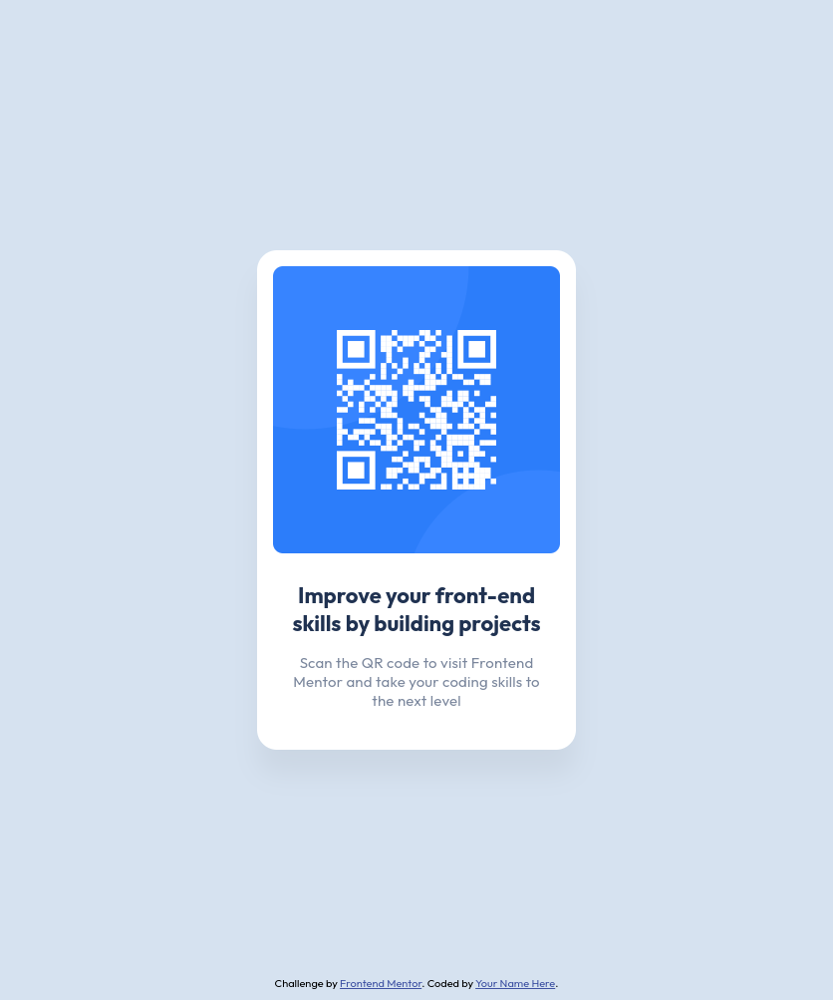

# Frontend Mentor - QR code component solution

This is a solution to the [QR code component challenge on Frontend Mentor](https://www.frontendmentor.io/challenges/qr-code-component-iux_sIO_H).

## Overview

### Screenshot

### Links

- Solution URL: [GitHub](https://github.com/ArunBohra12/qr-code-component)
- Live Site URL: [GitHub Pages](https://arunbohra12.github.io/qr-code-component)

## My process

### Built with

- HTML
- CSS

### Continued development

Use this section to outline areas that you want to continue focusing on in future projects. These could be concepts you're still not completely comfortable with or techniques you found useful that you want to refine and perfect.

**Note: Delete this note and the content within this section and replace with your own plans for continued development.**

## Author

- Website - [Arun Bohra](https://arun-bohra.com)
- Frontend Mentor - [@ArunBohra12](https://www.frontendmentor.io/profile/ArunBohra12)
- Twitter - [@ArunBohra122](https://www.twitter.com/ArunBohra122)
